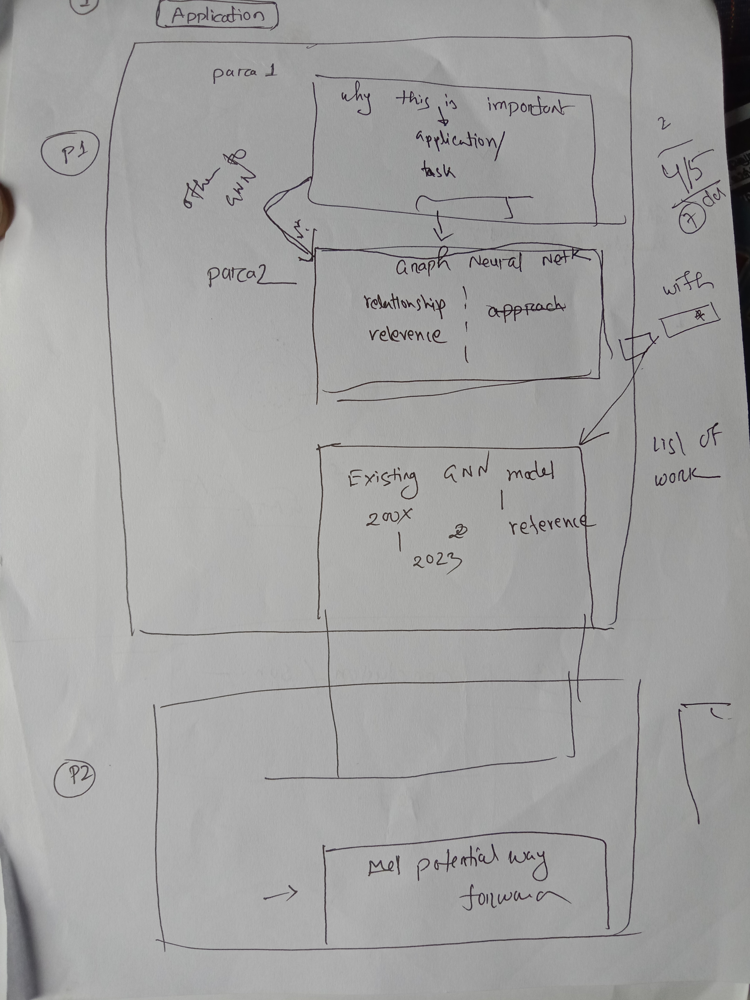
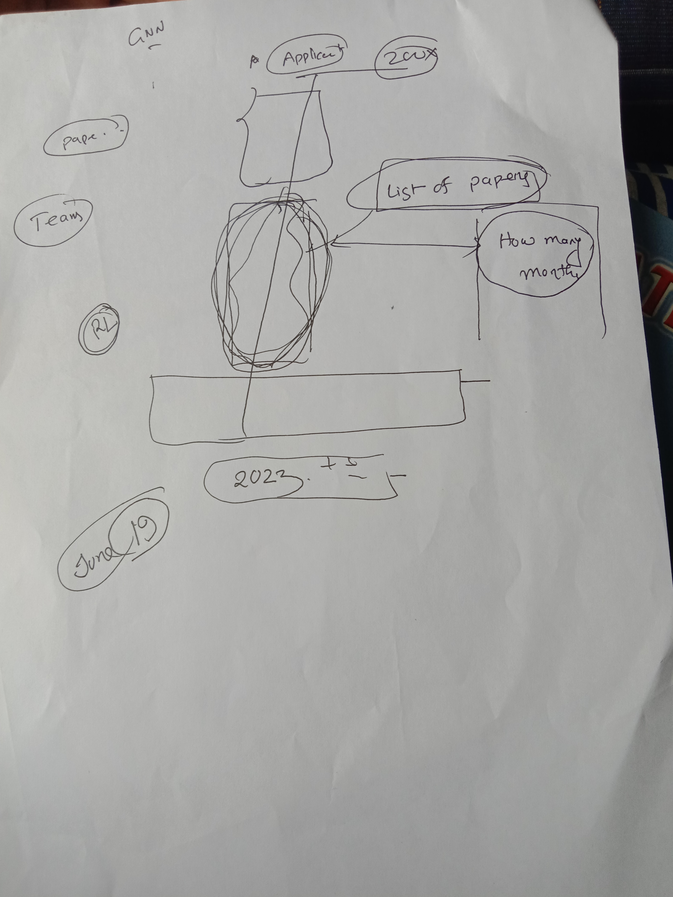
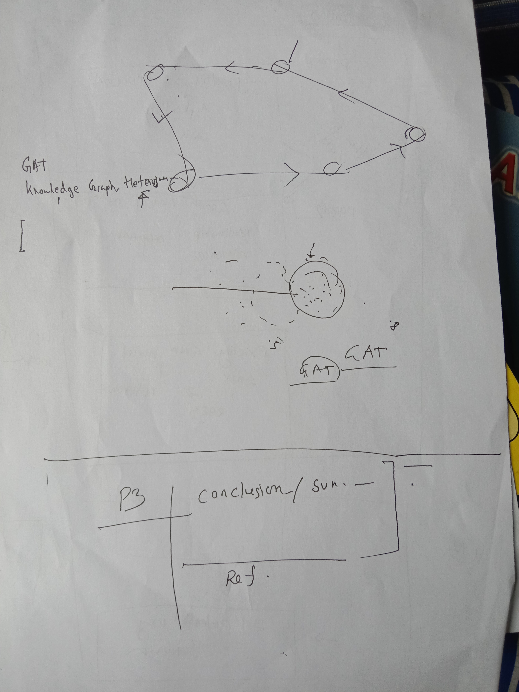

# Changelog 19 June 2023

- Initial idea formation
- Doc is prepared using primarily [Amanda Prorok | Learning Cooperative Control Policies for Multi-Robot Systems](https://www.youtube.com/live/ET33IvlTNAs?feature=share), [Another link](https://www.youtube.com/watch?v=ET33IvlTNAs&ab_channel=AirLab)
- Overleaf project name [MSThesisIdea](https://www.overleaf.com/9885665268vcctscsjybvf)
- Github folder name `InitialMSThesisIdeaForSir`
- Created based on sir's directions:

# Changelog 18 June 2023
- Initial presentation for sir.
- I have presented some GNN methods after some time spent learning GNN from [Stanford 224W](https://www.youtube.com/playlist?list=PLoROMvodv4rPLKxIpqhjhPgdQy7imNkDn) and Graph Representation Learning - William L. Hamilton ( Shared in Microsoft Teams Files, named GRL_Book)
- In overleaf, this file is named [MSThesisGNN](https://www.overleaf.com/7849464191czwzdphhvnkx)
- In github, folder name is `InitialPresentaionOnlyGNNForSir`
